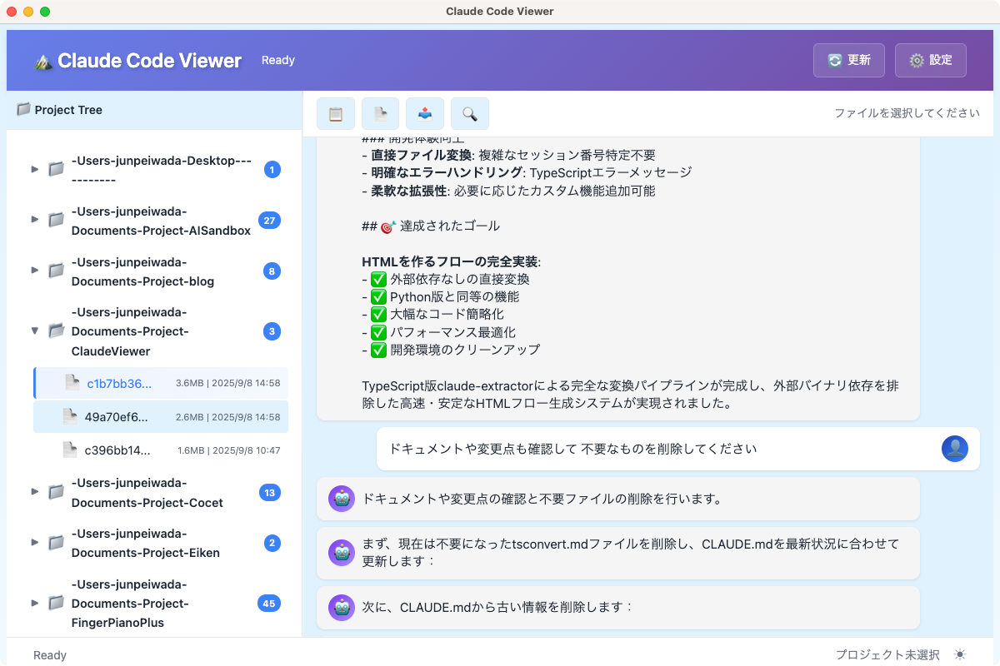

# Claude Code Viewer

🤖 **Claude Codeの会話ログ（JSONLファイル）を美しく閲覧するElectronアプリケーション**


## ✨ 主要機能

### 📁 プロジェクト管理
- **自動検出**: `~/.claude/projects` からすべてのプロジェクトを自動読み込み
- **Tree View**: 直感的なフォルダ階層表示
- **ファイル情報**: サイズ・日付表示、最新ファイルが自動的に上に表示

### 💬 最適化された会話表示
- **チャット風UI**: LINEやiMessage風の見やすい会話レイアウト
- **明確な視覚区別**: 
  - 👤 ユーザーメッセージ: 白背景、右寄せ配置
  - 🤖 Claudeメッセージ: 薄グレー背景、左寄せ配置
- **余白最適化**: より多くの会話内容を一画面で表示
- **長いURL対応**: 自動折り返しで横スクロール不要

### ⚡ 高速変換エンジン
- **TypeScript内蔵エンジン**: Python依存なし、外部プロセス不要
- **即座変換**: ファイル選択と同時に瞬時変換・表示
- **高品質フィルタリング**: システムメッセージ除去、実際の会話のみ抽出

### 📤 HTMLエクスポート機能
- **スタンドアロンHTML**: インラインCSS付きでどこでも表示可能
- **自動ファイル名**: `Session_{セッションID}_{日付}.html`
- **システム統合**: ネイティブファイル保存ダイアログ
- **ワンクリック保存**: 📤ボタンから即座エクスポート

## 📸 スクリーンショット



*Tree View（左）でプロジェクト・ファイルを管理し、右側でチャット風の会話表示*

### 主要UI要素
- **左ペイン**: プロジェクト階層・ファイル一覧（サイズ・日付表示）
- **右ペイン**: チャット風会話表示（ユーザー右・Claude左の明確な区別）
- **ヘッダー**: 更新ボタン
- **ツールバー**: 全選択・コピー・HTMLエクスポート
- **フッター**: ステータス表示・選択ファイル情報

## 🚀 クイックスタート

### 📥 バイナリダウンロード（推奨）

**macOS用ユニバーサルバイナリ**（Intel・Apple Silicon両対応）

[](https://github.com/Junpeiwada/ClaudeViewer/raw/main/dist/build/Claude%20Code%20Viewer-1.0.0-universal.dmg)

- **ファイル**: `Claude Code Viewer-1.0.0-universal.dmg`（170MB）
- **対応macOS**: 10.15 (Catalina) 以降
- **CPU**: Intel Mac・Apple Silicon（M1/M2/M3）両対応

#### インストール手順
1. 上記リンクからDMGファイルをダウンロード
2. DMGファイルをダブルクリック
3. Claude Code Viewer.appを「アプリケーション」フォルダにドラッグ
4. **初回起動**: 下記のセキュリティ設定を参照

#### ⚠️ macOSセキュリティ設定（重要）

**未署名アプリのため、初回起動時にmacOSのセキュリティ機能により起動がブロックされます。**

##### 🔓 回避方法（いずれか1つを実行）

**方法1: Control+クリックで開く（推奨）**
1. `Claude Code Viewer.app`を**Control+クリック**
2. メニューから「**開く**」を選択
3. 警告ダイアログで「**開く**」をクリック

**方法2: システム設定から許可**
1. アプリをダブルクリック（エラー表示）
2. **システム設定** → **プライバシーとセキュリティ**
3. 「**このまま開く**」ボタンをクリック

**方法3: ターミナルコマンド（上級者向け）**
```bash
# Quarantine属性を削除
sudo xattr -r -d com.apple.quarantine "/Applications/Claude Code Viewer.app"
```

> **注意**: これらの設定は初回のみ必要です。一度許可すれば、以後は通常通り起動できます。

### 🛠️ 開発者向けビルド

### 前提条件
- **Node.js 18+** 
- **Claude Code** 使用済み（`~/.claude/projects` フォルダ存在）

### ソースコードからビルド
```bash
# リポジトリクローン
git clone https://github.com/yourusername/claude-code-viewer.git
cd claude-code-viewer

# 依存関係インストール
npm install

# 開発モードで起動
npm run dev

# または本番ビルド
npm run build
npm run dist:mac  # DMGパッケージ作成
```

### 使い方
1. **アプリ起動**: `npm run dev`
2. **プロジェクト選択**: 左ペインでフォルダをクリック
3. **会話閲覧**: ファイルをクリックで即座表示
4. **テキストコピー**: ドラッグ選択 → Cmd+C

## 🛠️ 技術仕様

### アーキテクチャ
- **Electron 27.1.0**: クロスプラットフォームデスクトップアプリ
- **TypeScript 5.3.0**: 型安全な開発環境
- **内蔵変換エンジン**: Python不要の高速TypeScript実装
- **セキュア設計**: `contextIsolation: true`, `nodeIntegration: false`

### パフォーマンス
- **🚀 高速起動**: 外部プロセス不要
- **⚡ 瞬時変換**: TypeScript直接実行
- **💾 軽量**: 270MBバイナリ削除済み
- **📊 高効率**: 98%サイズ削減（元版同等品質）

### ファイル構成
```
src/
├── main/main.ts           # Electronメインプロセス
├── lib/claudeExtractor.ts # TypeScript版変換エンジン
└── renderer/              # フロントエンドUI
    ├── index.html         # Tree View + 会話表示
    ├── renderer.ts        # UI管理・イベント処理
    └── styles.css         # スタイルシート
```

## 🎯 開発コマンド

```bash
# 開発
npm run dev              # 開発モードで起動
npm run watch            # ファイル監視モード

# ビルド
npm run build            # 全体ビルド
npm run build:main       # メインプロセスのみ
npm run build:renderer   # レンダラーのみ

# コード品質
npm run lint             # ESLint実行
npm run format           # Prettier実行

# 配布
npm run dist             # .dmgパッケージ作成（macOS）
```

## 🌟 主な改善点

### Phase 7-8で実装された最新機能
- ✅ **会話UI完全再設計**: チャット風の直感的表示
- ✅ **視覚的区別強化**: ユーザー・Claudeメッセージの明確な分離
- ✅ **ファイル管理強化**: サイズ表示・日付ソート・Tree View最適化
- ✅ **エラーハンドリング改善**: 小さなファイルやメタメッセージのみのファイルに対応
- ✅ **余白最適化**: より多くの会話内容を表示可能
- ✅ **HTMLエクスポート**: スタンドアロンHTML保存機能
- ✅ **UI簡素化**: 不要機能削除（PDF・検索・設定）でスッキリした操作感

## 📋 ロードマップ

### ✅ 完了済み（Phase 1-8）
- [x] TypeScript + Electron基盤構築
- [x] Tree View + 会話表示UI
- [x] プロジェクト・ファイル管理
- [x] 内蔵TypeScript変換エンジン
- [x] UI/UX最適化・エラーハンドリング強化
- [x] HTMLエクスポート機能・UI簡素化

### 🚀 今後の予定
- [ ] **Phase 10**: パッケージング・配布準備（.dmg作成）

## 🤝 コントリビューション

1. Forkしてください
2. フィーチャーブランチを作成: `git checkout -b feature/amazing-feature`
3. 変更をコミット: `git commit -m 'Add amazing feature'`
4. ブランチにPush: `git push origin feature/amazing-feature`
5. Pull Requestを作成

## 📄 ライセンス

このプロジェクトは**MITライセンス**の下で公開されています。

```
MIT License

Copyright (c) 2025 Claude Code Viewer

Permission is hereby granted, free of charge, to any person obtaining a copy
of this software and associated documentation files (the "Software"), to deal
in the Software without restriction, including without limitation the rights
to use, copy, modify, merge, publish, distribute, sublicense, and/or sell
copies of the Software, and to permit persons to whom the Software is
furnished to do so, subject to the following conditions:

The above copyright notice and this permission notice shall be included in all
copies or substantial portions of the Software.

THE SOFTWARE IS PROVIDED "AS IS", WITHOUT WARRANTY OF ANY KIND, EXPRESS OR
IMPLIED, INCLUDING BUT NOT LIMITED TO THE WARRANTIES OF MERCHANTABILITY,
FITNESS FOR A PARTICULAR PURPOSE AND NONINFRINGEMENT. IN NO EVENT SHALL THE
AUTHORS OR COPYRIGHT HOLDERS BE LIABLE FOR ANY CLAIM, DAMAGES OR OTHER
LIABILITY, WHETHER IN AN ACTION OF CONTRACT, TORT OR OTHERWISE, ARISING FROM,
OUT OF OR IN CONNECTION WITH THE SOFTWARE OR THE USE OR OTHER DEALINGS IN THE
SOFTWARE.
```

## 🙏 謝辞・参照

このプロジェクトは以下のプロジェクトとツールを参考に開発されました：

### 主要参照
- **[claude-conversation-extractor](https://github.com/ZeroSumQuant/claude-conversation-extractor)**: JSONL変換ロジックとMarkdown出力フォーマットの参考実装
  - 本プロジェクトの変換エンジンは、同プロジェクトの出力仕様に準拠
  - TypeScript版として完全に再実装し、Python依存関係を排除

### 技術基盤
- **[Claude Code](https://claude.ai/code)**: 素晴らしいAI開発ツールの提供
- **[Electron](https://www.electronjs.org/)**: クロスプラットフォームアプリケーション開発基盤
- **[TypeScript](https://www.typescriptlang.org/)**: 型安全な開発環境

---

**Claude Code Viewer** で、あなたのAI開発体験をより豊かにしましょう！ 🚀